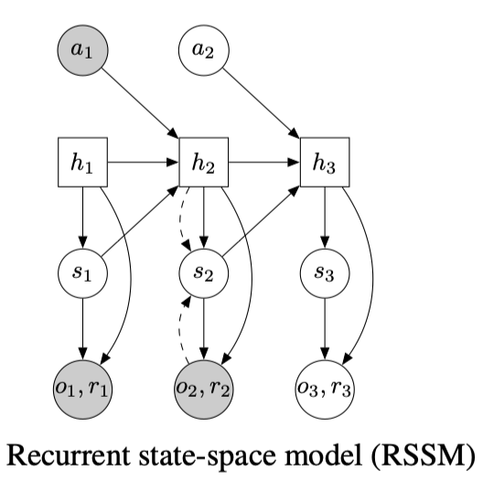
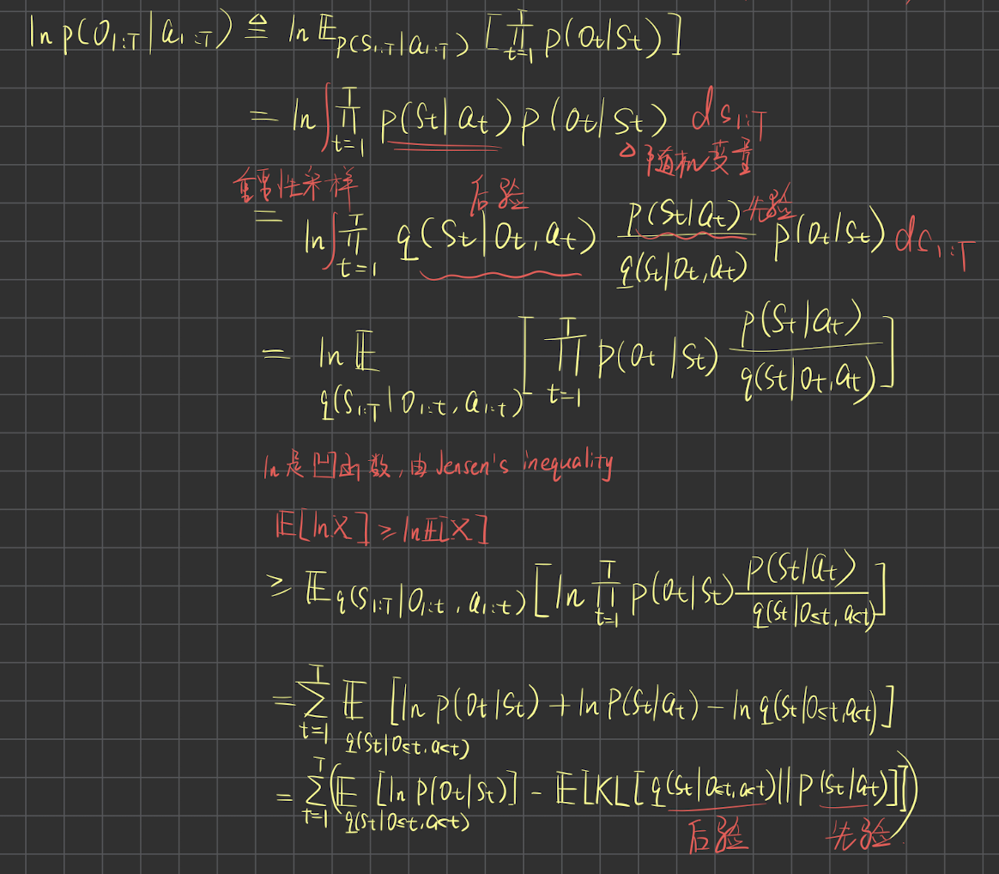

# My_PlaNet Pytorch 实现

[论文: Learning Latent Dynamics for Planning from Pixels](https://arxiv.org/abs/1811.04551 "pytorch 复现")

---

## 项目简介

该项目为论文: Learning Latent Dynamics for Planning from Pixels 提供了 pytorch 框架下的实现，代码简单易读，配有详细的中文注释，帮助从数学理论转化到代码实现。

- 训练过程
- 模型架构（Encoder | Recurent State Space Model | Observation Model | Reward Model）
- ELBO 的详细数学推导（比论文中的推导更加详细，且提供了另一个推导的视角，帮助读者理解变分推导的本质）

---

## 模型架构



1. Encoder:

   将观察到的图像编码到低维空间，降低计算复杂度
2. Recurent State Space Model

   - Prior

     **deterministic state model:**

     $$h_{t+1} = f(h_t, s_t, a_t)$$

     其中 $f(·)$ 是 `GRU` 网络

     **Stochastic state model:**

     $$s_{t+1}  \sim p(s_{t+1} | h_{t+1})$$
   - Posterior（需要先验计算出的 deterministic  state 来计算后验）

     $$s_{t+1} \sim q(s_{t+1} | h_{t+1}, o_{t+1})$$
3. Observation Model

   $$o_t \sim p(o_t | h_t, s_t)$$
4. Reward Model

   $$r_t \sim p(r_t | h_t, s_t)$$

---

## 项目结构

```text
My_PlaNet/
├── log/                 # 训练日志、模型权重
├── train.py             # 训练文件
├── test.py              # 测试文件
├── model.py             # 模型 (Encoder RSSM Observation Reward)
├── agent.py             # CEM planner
├── utils.py             # 经验回放池、图像预处理（降低位深度）
├── wrappers.py          # 环境装饰器（dm_control -> gym）
├── viewer.py            # OpenCVImageViewer
└── video_prediction.py  # 生成预测图像视频
```

---

## 快速开始

### 环境要求

- dm_control==1.0.13
- gym==0.26.2
- opencv-python==4.11.0.86
- numpy==1.21.6
- torch==1.13.1
- mujoco==2.3.7

### 安装指南

```bash
git clone https://github.com/Jinhsi555/My_PlaNet.git
cd My_PlaNet
pip install -r requirements.txt
```

### 基础用法

#### 训练

```bash
python train.py
```

#### 测试

```bash
python test.py dir
```

#### 生成预测视频

```bash
python video_prediction.py dir
```

---

## 进阶选项

### Linux 服务器运行

`Xvfb`（X Virtual Framebuffer）是一个虚拟的X服务器，它可以在没有物理显示设备的情况下运行图形应用程序。

```bash
Xvfb :99 -screen 0 1024x768x24 &
export DISPLAY=:99
python video_prediction.py dir
```

### Tensorboard 训练日志可视化

```bash
tensorboard --logdir=log --port=6006
```

启动后，你可以通过浏览器访问这个 `TensorBoard` 实例。

## 预测效果

### cheetah run

``

### Reacher Easy

``

由于设备算力和时间有限，这里展示的效果是只进行了 600 次训练的结果

## 证明

**ELBO 证据下界的两种推导：**

先从 VAE 的原理入手：


再推广到论文中的 Training Objective（这里只给出了第一种，第二种读者可以参考 VAE 的第二种方法自行推导）：



## Reference

- [Learning Latent Dynamics for Planning from Pixels](https://arxiv.org/abs/1811.04551)
- [cross32768 PlaNet_PyTorch](https://github.com/cross32768/PlaNet_PyTorch.git "pytorch 复现")
- [Official Implementation](https://github.com/google-research/planet.git "pytorch 复现")

---

## 联系方式

📧 联系邮箱：wlb17302889331@163.com
